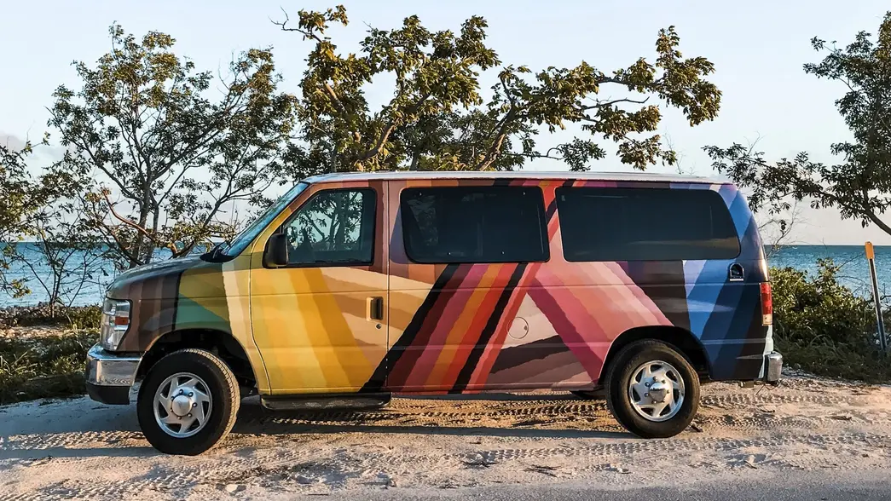

# Campers App

## Опис проекту

**Campers App** — це веб-застосунок для бронювання кемперов. Він дозволяє користувачам шукати та зберігати улюблені кемпери, а також вибирати дати для бронювання за допомогою інтуїтивно зрозумілого інтерфейсу.

### Journey Made Simple

## Технології

## Проект реалізований за допомогою:

- **React**: Бібліотека для побудови користувацького інтерфейсу.
- **Redux**: Для управління станом.
- **Formik**: Для роботи з формами.

## Ліцензія

Цей проект ліцензовано за ліцензією MIT. Ви можете використовувати, копіювати та модифікувати його, але не маєте права розповсюджувати чи продавати цей проект у комерційних цілях. Для деталей дивіться файл LICENSE.

Зразок для README.md
Ось як ви можете це включити в свій файл README.md:

markdown
Copy code

## Ліцензія

Цей проект має копірайт і не може бути розповсюджений у комерційних цілях без письмового дозволу автора. Ви можете використовувати, копіювати та модифікувати його, але не маєте права розповсюджувати чи продавати цей проект у комерційних цілях.

Деталі копірайту дивіться у файлі [COPYRIGHT.md](public/COPYRIGHT.txt).

## Контакти

Для співпраці чи запитів, будь ласка, зв’яжіться зі мною:

- **Марина Назіна**: [nzyame@gmail.com]
- **GitHub**: [[GitHub Maryna Nazina](https://github.com/nazinamari)]
