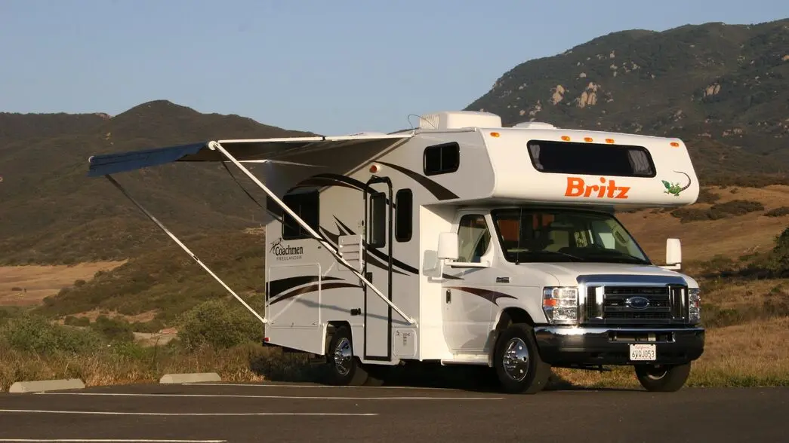

# Campers App

## Опис проекту

**Campers App** — це респонсивний веб-додаток для бронювання кемперів. Він дозволяє користувачам шукати та зберігати свої улюблені кемпери, а також вибирати дати для бронювання через інтуїтивно зрозумілий інтерфейс.

### Journey Made Simple

## Технології

### Цей проект створений за допомогою **JavaScript** і використовує наступні технології:

- **React**: Бібліотека для побудови користувацького інтерфейсу.
- **Redux Toolkit**: Для управління станом.
- **React Router**: Для маршрутизації між різними сторінками додатку.
- **React Modal**: Для реалізації модальних вікон у додатку.
- **CSS Modules**: Для стилізації компонентів.
- **clsx**: Утиліта для умовного поєднання класів CSS, що спрощує управління стилями в компонентах.
- **Formik**: Для роботи з формами.
- **Yup**: Для валідації форм.
- **React DatePicker**: Для вибору дати.
- **Axios**: Для виконання HTTP-запитів.
- **Swiper**: Для реалізації слайдеру.
- **Local Storage**: Для зберігання даних, таких як обрані кемпери, у браузері користувача навіть після перезавантаження сторінки.
- **Responsive Design**: Для гнучкого відображення сайту на будь-яких пристроях і розмірах екранів.

### Основні функції

- **Фільтрація**: Додаток дозволяє користувачам фільтрувати кемпери за місцем розташування, типом транспортного засобу та обладнанням.
- **Додати до обраних**: Користувачі можуть додавати кемпери до списку обраних для зручного доступу в майбутньому.
- **Бронювання кемперу**: Можливість заповнити та надіслати форму для бронювання кемпера на майбутні дати.
- **Слайдер**: Візуальний елемент для демонстрації зображень кемперів або рекламних матеріалів.
- **Модальне вікно**: Інтерфейс для відображення додаткової інформації про кемпери, що дозволяє користувачам швидко переглядати деталі без переходу на іншу сторінку.

## Ліцензія

Цей проект має копірайт і не може бути розповсюджений у комерційних цілях без письмового дозволу автора. Ви можете використовувати, копіювати та модифікувати його, але не маєте права розповсюджувати чи продавати цей проект у комерційних цілях.

Деталі копірайту дивіться у файлі [COPYRIGHT.txt](public/COPYRIGHT.txt).

## Контакти

Для співпраці чи запитів, будь ласка, зв’яжіться зі мною:

- **Марина Назіна**: [nzyame@gmail.com]
- **GitHub**: [[GitHub Maryna Nazina](https://github.com/nazinamari)]

/------------------------------------------------------------------------------/

# Campers App

## Project Description

**Campers App** is a responsive web application for booking campers. It allows users to search for and save their favorite campers and select booking dates through an intuitive interface.

### Journey Made Simple

## Technologies

### This project is built using **JavaScript** and utilizes the following technologies:

- **React**: A library for building user interfaces.
- **Redux Toolkit**: For state management.
- **React Router**: For navigation between different app pages.
- **React Modal**: For implementing modal windows.
- **CSS Modules**: For styling components.
- **clsx**: A utility for conditionally combining CSS classes, simplifying style management.
- **Formik**: For handling forms.
- **Yup**: For form validation.
- **React DatePicker**: For selecting dates.
- **Axios**: For making HTTP requests.
- **Swiper**: For creating sliders.
- **Local Storage**: To store data, such as favorite campers, in the user's browser, even after the page reloads.
- **Responsive Design**: For flexible display across different devices and screen sizes.

### Key Features

- **Filtering**: The app allows users to filter campers by location, vehicle type, and amenities.
- **Add to Favorites**: Users can add campers to their favorites list for easy access later.
- **Camper Booking**: Users can fill out and submit a form to book a camper for future dates.
- **Slider**: A visual element to showcase camper images or promotional content.
- **Modal Window**: Provides additional information about campers without navigating to another page.

## License

This project is copyrighted and cannot be distributed for commercial purposes without written permission from the author. You may use, copy, and modify it, but you are not allowed to distribute or sell it for commercial purposes.

For copyright details, see the [COPYRIGHT.txt](public/COPYRIGHT.txt) file.

## Contact

For collaboration or inquiries, feel free to contact me:

- **Maryna Nazina**: [nzyame@gmail.com]
- **GitHub**: [GitHub Maryna Nazina](https://github.com/nazinamari)
